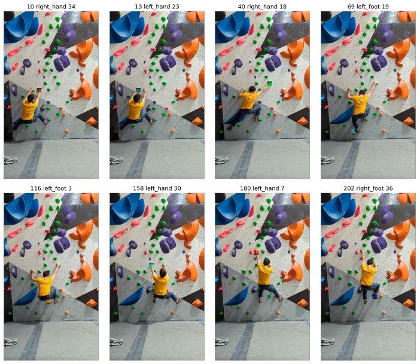
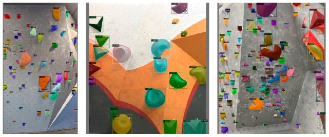

# SMEAR BETA

This repository contains the source code for a project that analyzes indoor climbing videos using computer vision techniques. The project is designed to detect and track climbers as they ascend a climbing wall to output an analysis on the climber's beta. We provide a custom fine-tuned MaskRCNN model to detect climbing holds as well as the custom dataset used to train the model. The project leverages YOLOv7 for climber detection and pose estimation.




## Installation

Clone the repository into your source directory:

```bash
git clone https://github.com/mcloses/smear-beta/
```

Clone the following implementation of the YOLOv7 paper into the same parent folder:

```bash
git clone https://github.com/WongKinYiu/yolov7
```

Configure the environment by installing the required packages:

```bash
cd smear-beta
conda create -n smear-beta python=3.9.7
conda activate smear-beta
pip install -r requirements.txt
```

## Usage

To run the implementation a video with the following requirements is needed:

- The video must be recorded from a fixed position
- The video must contain only a single climber
- At least the first frame of the video must show all the holds belonging to the route
- The start and finishing frames must be provided manually

The video must be placed in the `data/raw/vid/` directory. When run, the analysis pipeline will provide an interactive screen to select all the holds belonging to the route. An optional image of the route and climbing wall can be provided to assist in the selection process. If no image is provided, the first frame of the video will be used.

The video analysis pipeline is run using the `main.ipynb` file.

The output of the analysis will be saved into `data/output/runs/`.

You can find more details about the project and implementation in the [thesis](thesis.pdf) file.

## Contributing

If you would like to contribute to the project, please follow these steps:

1. Fork the repository
2. Create a new branch for your feature or bug fix
3. Make your changes and commit them with clear commit messages
4. Push your changes to your fork
5. Submit a pull request to the `dev` branch of the main repository

## License

This project is licensed under the GNU GPLv3 License - see the [LICENSE](LICENSE) file for details.